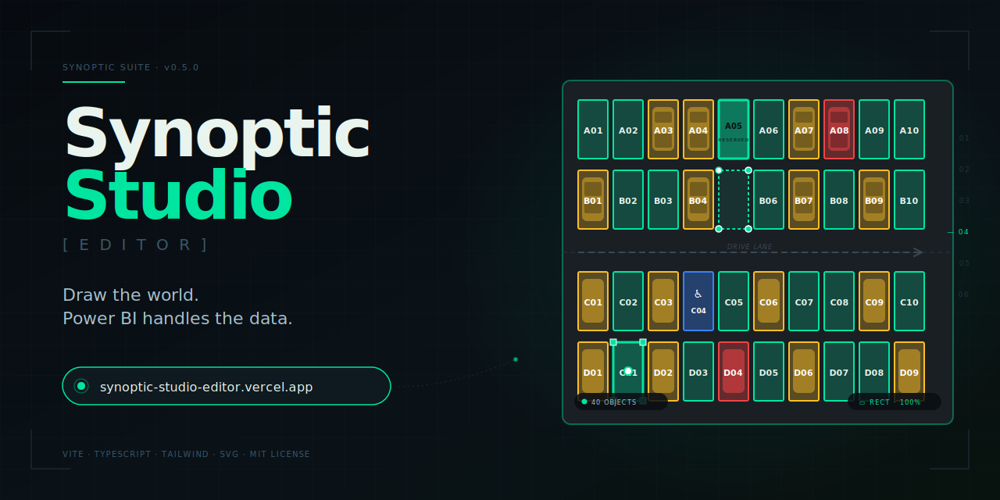

<div align="center">



# Synoptic Studio Editor

**A visual editor for designing Power BI synoptic layouts.**
Draw shapes over any image. Export coordinates. Visualize your data in physical space.

[🚀 **Live Demo** — synoptic-studio-editor.vercel.app](https://synoptic-studio-editor.vercel.app)

Companion to the [**Synoptic Studio Power BI visual**](https://github.com/Automatajm/synoptic-studio) — together they let you turn any image into a data-driven map that filters your Power BI report on click.


</div>

---

## What this is

You have an image — a floor plan, a dental chart, a parking lot, a factory layout, a country map, an aircraft seat diagram. You want to bind data to specific regions of that image inside Power BI: which beds in the greenhouse are at capacity, which teeth a patient has issues with, which parking spots are reserved, which factory stations are down.

This editor lets you **trace those regions visually** — rectangles or polygons — name them, and export an Excel/CSV file ready for Power BI. Then the [Synoptic Studio visual](https://github.com/Automatajm/synoptic-studio) reads that file and draws the same regions in your report, colored by your data and clickable to cross-filter everything else.

It's a small piece of glue, but it's the piece that turns "I have an image" into "I have an interactive data dashboard built on that image."

## The two-product workflow

```
┌──────────────────────────────────────────────────────────────┐
│                                                              │
│   1. EDITOR (this repo, in your browser)                     │
│      ↓ upload an image                                       │
│      ↓ trace shapes with mouse                               │
│      ↓ name each shape                                       │
│      ↓ export                                                │
│                                                              │
│   ─────────────── coordinates.xlsx ───────────────►          │
│                                                              │
│   2. POWER BI                                                │
│      ↓ load the coordinates file                             │
│      ↓ join with your business data                          │
│      ↓ drop the Synoptic Studio visual on the canvas         │
│      ↓ bind the columns                                      │
│                                                              │
│   3. DONE — interactive synoptic map in your report          │
│                                                              │
└──────────────────────────────────────────────────────────────┘
```

You only run the editor **once per layout** — the export file is permanent. Update your business data in Power BI and the visual updates colors automatically.

---

## Features

### Drawing tools
- **Rectangle** (R) — click and drag for axis-aligned regions
- **Polygon** (P) — click points, double-click or Enter to close. Tracing-friendly with vertex previews and a dashed closing-edge preview
- **Select** (V) — move and edit existing shapes

### Geometry editing
- Move any shape by dragging
- Resize rectangles with 8 corner/edge handles
- **Manual centroid override** — drag the small white anchor dot on the selected shape to position its label exactly where you want it. Right-click the anchor to reset to the geometric centroid. Useful for irregularly-shaped regions where the math center looks awkward.

### Canvas controls
- **Pan** — Alt+drag or middle-click drag
- **Zoom** — mouse wheel zooms toward cursor (no center-jumps)
- **Fit to viewport** — single click to center and scale the whole layout
- **Snap to grid** — optional toggle, 10-unit grid

### Image backgrounds — two modes
- **Embed (base64)** — image is encoded directly into the export. Good for small images and offline workflows. The editor runs a **pre-flight compression check** before you start working, warning you if no compression strategy fits Power BI's 32K-character cell limit. This avoids wasting an hour of tracing only to discover at export time that the image won't fit.
- **External URL** — image is referenced by a public URL (Imgur, S3, GitHub raw, etc). No size cap. Recommended for large floor plans, satellite imagery, or detailed CAD exports.

### Export — Excel or CSV
- **Object_ID**, **Label** — unique identifier and display text for each shape
- **Layout_X / Y / W / H** — bounding box in relative 0–100% coordinates (works at any visual size in Power BI)
- **Polygon_Points** — for polygons, semicolon-separated `x,y` pairs in relative coordinates
- **Centroid_X / Y** — label anchor / graph node position. Respects manual override, falls back to area-weighted geometric centroid (which correctly stays inside L-shapes, U-shapes, and any non-convex polygon)
- **Canvas_W / H** — the canvas size used for tracing
- **Image_URL** — embedded data URI or external URL (written only on the first row to keep file size down)
- The exporter automatically picks the best compression (AVIF → WebP → JPEG cascade) for the chosen format

### Keyboard shortcuts

| Key | Action |
| --- | --- |
| `V` | Select tool |
| `R` | Rectangle tool |
| `P` | Polygon tool |
| `Delete` / `Backspace` | Delete selected shape |
| `Enter` (in polygon) | Close polygon |
| `Escape` | Cancel polygon / clear selection |
| Wheel | Zoom toward cursor |
| Alt+drag or middle-click drag | Pan |
| Right-click on shape | Delete shape |
| Right-click on centroid anchor | Reset to geometric center |

---

## Use cases

| Industry | Background image | Shape type |
| --- | --- | --- |
| Agriculture | Greenhouse layout, CAD plan | Rectangles for beds |
| Healthcare | Dental chart, anatomical diagrams | Polygons for teeth, organs |
| Hospitality | Hotel floor plan | Rectangles for rooms |
| Manufacturing | Factory photo or layout | Mixed: rect for stations, polygons for zones |
| Retail | Store floor plan | Rectangles for shelves / departments |
| Logistics | Warehouse layout | Rectangles for racks / pallets |
| Geographic | Country / region map | Polygons for regions |
| Transportation | Aircraft / bus / train seat map | Rectangles for seats |
| Entertainment | Stadium / theater seating | Polygons for sections |

Anywhere physical layout matters to your data — and that's a lot of places.

---

## Quick start

### Use it without installing

Just open the live demo:

👉 **https://synoptic-studio-editor.vercel.app**

Browser-only, no signup, no data leaves your machine.

### Run locally

```bash
git clone https://github.com/Automatajm/synoptic-studio-editor.git
cd synoptic-studio-editor
npm install
npm run dev
```

Open `http://localhost:5173`.

### Build for production

```bash
npm run build
npm run preview
```

Output goes to `dist/` — deploy that folder to any static host.

---

## Step-by-step: from image to Power BI

1. **Load your image** — click `📷 Load image`. Choose Embed for small images (<32K compressed) or External URL for anything larger. The editor will warn you in advance if your image is too large for embed mode.

2. **Trace your shapes** — pick a tool, draw, name them in the sidebar. Use polygons for non-rectangular regions; the editor's centroid math handles concave shapes correctly so labels stay inside.

3. **Export** — click `↓ Export`, pick Excel or CSV. Excel is friendlier for review/editing; CSV is better when you have a large embedded image (CSV cells have no size limit).

4. **In Power BI** — import the file. Drop the [Synoptic Studio visual](https://github.com/Automatajm/synoptic-studio) onto a report. Bind the columns:
   - `Object_ID` → **Object ID** field
   - `Layout_X / Y / W / H` → **Layout X / Y / W / H** fields
   - `Polygon_Points` → **Polygon Points** field
   - `Image_URL` → **Image URL** field
   - Your business measures → **Main Value**, **Color Field**, etc.

5. **Define color rules** in the visual (or import them) — and you're done. Click any shape in the report to cross-filter the rest of your visuals.

---

## Tech stack

- **[Vite](https://vitejs.dev)** + **[TypeScript](https://www.typescriptlang.org)** — fast HMR, strict types, no framework runtime
- **Vanilla SVG** — same paradigm as the Power BI visual; no canvas-library dependency means small bundle and full control
- **[Tailwind CSS](https://tailwindcss.com)** — utility-first styling
- **[SheetJS](https://sheetjs.com)** — Excel I/O
- **[Vercel](https://vercel.com)** — zero-config deploy from GitHub

Total runtime bundle: ~125KB minified, ~46KB gzipped.

---

## Architecture

The editor is intentionally split into clean modules — one responsibility each:

```
src/
├── editor/
│   ├── Editor.ts          # top-level controller; wires UI + state
│   ├── Canvas.ts          # SVG rendering, interaction, pan/zoom
│   ├── ShapeManager.ts    # single source of truth for all shapes
│   └── types.ts           # Shape, Point, BackgroundImage definitions
├── ui/
│   ├── Toolbar.ts         # top bar
│   ├── Sidebar.ts         # objects list
│   └── ImageSourceModal.ts
├── lib/
│   ├── coordinates.ts     # relative-coordinate conversion, snap, round
│   ├── centroid.ts        # area-weighted geometric centroid
│   ├── labels.ts          # uuid + auto-increment naming
│   └── image.ts           # AVIF/WebP/JPEG compression cascade
└── io/
    ├── exportXlsx.ts
    └── exportCsv.ts
```

All shape mutations go through `ShapeManager`, which notifies listeners. `Canvas` only reads — never writes shape state directly. This keeps the data flow single-threaded and easy to reason about.

---

## Roadmap

### Coming in v0.6
- [ ] Undo / Redo (Ctrl+Z / Ctrl+Y)
- [ ] Import existing CSV / Excel for editing
- [ ] Downloadable template for manual entry
- [ ] Drag-drop image loading
- [ ] Polygon vertex editing wired (handles render but currently move the whole polygon)

### Future
- [ ] Multi-select with rubber-band drag
- [ ] Bulk operations (delete, rename with prefix)
- [ ] Snap to other shapes (alignment guides)
- [ ] Auto-grid generator (place N numbered rectangles in a grid)
- [ ] Layout templates (conference room, dental chart, parking lot, etc.)
- [ ] Project save/load (browser storage or file)
- [ ] Custom domain: `editor.synopticstudio.app`

If you'd find one of these particularly useful, [open an issue](https://github.com/Automatajm/synoptic-studio-editor/issues) and say so — it helps prioritize.

---

## The Synoptic Suite

This editor is part of a broader ecosystem:

| Product | What it is | Status |
| --- | --- | --- |
| **[Synoptic Studio](https://github.com/Automatajm/synoptic-studio)** | Power BI custom visual that renders the synoptic map and handles cross-filtering | v1.2.0 — AppSource certification in progress |
| **Synoptic Studio Editor** (this) | Web app for designing the layout | v0.5.0 — live |
| Synoptic Pane | SVG-embedded variant of the visual (different ingestion model) | planned |

They are independent products that work together. You can use the visual without the editor (write coordinates by hand in Excel) and you can use the editor for non-Power-BI purposes (export the SVG, embed it elsewhere) — but the combination is where most of the value sits.

---

## License

[MIT](./LICENSE) — use it freely, including commercially. Attribution appreciated but not required.

---

## Author

Built by **[Juan Mendoza (Automatajm)](https://github.com/Automatajm)** — Financial Analysis Manager at Costa Farms, building automation tools and commercial software in his spare time. Originally built to solve a real problem mapping 118 greenhouses with 2.8M plants; turns out the same pattern shows up everywhere physical layout meets data.

Contact: [synopticstudio@hotmail.com](mailto:synopticstudio@hotmail.com)
